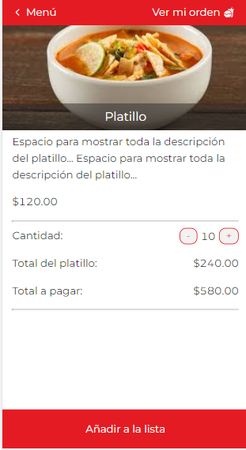

# Restaurant-App
Este proyecto fue desarrollado con la librería llamada [ReactJS](https://es.reactjs.org), consiste en dos partes, la primera es un sitio público donde se visualizan todos los platillos del menú disponibles y por otra parte el panel de administrador el cual gestiona todos los platillos y más.

# Capturas

* ## Sitio público:
Home del sitio donde se visualizan una presentación de platillos favoritos y promociones.

En esta sección se muestra el menú y las categorías.

Aquí se pueden ver los detalles de cada platillo y la opción de añadir a lista de orden.

En este apartado se ve el detalle de la orden con los totales a pagar.

* ## Panel administrativo

El usuario administrador tendrá acceso a este panel el cual hace lo siguiente.
Gestiona los platillos que los clientes verán en el menú.

Podrá agregar nuevos platillos.

Opción de agregar nuevas categorías o eliminarlas.

